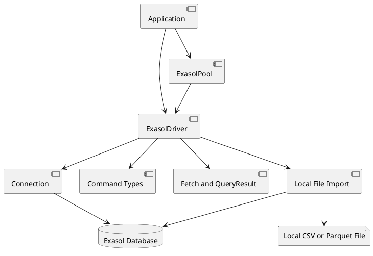

# Building Block View

This chapter describes the static decomposition of the system into building blocks and responsibilities.

## Component Overview

## Component Design Items

### Driver API
`dsn~driver-api~4`

`ExasolDriver` is the primary facade for connecting, authenticating, querying, executing commands, preparing statements, cancelling work, closing sessions, and starting CSV and Parquet imports. It supports asynchronous disposal by delegating `Symbol.asyncDispose` to `close()`.

Covers:
- `scn~connect-with-basic-authentication~1`
- `scn~reject-missing-credentials~1`
- `scn~query-returns-rows~1`
- `scn~execute-returns-row-count~1`
- `scn~raw-response-requested~1`
- `scn~prepared-statement-execution~1`
- `scn~cancel-active-work~1`
- `scn~csv-import-is-cancelled~1`
- `scn~parquet-import-is-cancelled~1`
- `scn~session-attributes-sent-during-login~1`
- `scn~async-dispose-driver~1`
- `scn~async-dispose-prepared-statement~1`

### WebSocket Connection
`dsn~websocket-connection~1`

`Connection` owns a single `ExaWebsocket`, serializes protocol commands, optionally compresses command payloads, parses responses, handles cancellation, prevents parallel work on the same active connection, and marks itself broken when an in-flight command loses its WebSocket.

Covers:
- `scn~browser-connection-uses-native-websocket~1`
- `scn~node-connection-uses-injected-websocket~1`
- `scn~cancel-active-work~1`
- `scn~reject-command-on-unexpected-websocket-termination~1`

### Result Handling
`dsn~result-handling~1`

The result handling layer fetches additional result pages when needed, closes remote result sets, applies `resultSetMaxRows`, and exposes row-oriented data through `QueryResult`.

Covers:
- `scn~query-returns-rows~1`
- `scn~result-row-limit-applied-during-fetch~1`

### Pool API
`dsn~pool-api~3`

`ExasolPool` wraps `generic-pool` and manages reusable `ExasolDriver` instances according to configured minimum and maximum pool size. It validates idle drivers before borrowing them and supports asynchronous disposal by draining and then clearing the pool.

Covers:
- `scn~pool-reuses-drivers-for-queries~1`
- `scn~pool-enforces-configured-size-limits~1`
- `scn~pool-shutdown~1`
- `scn~async-dispose-connection-pool~1`
- `scn~replace-idle-closed-pooled-driver~1`

### CSV Import Components
`dsn~csv-import-components~1`

The CSV import modules verify local file readability, create an Exasol import tunnel, wrap the tunnel with TLS, build Exasol `IMPORT FROM CSV` SQL, stream the file as chunked HTTP response data, and return the SQL row count.

Covers:
- `scn~csv-import-succeeds~1`
- `scn~csv-import-rejects-missing-file~1`
- `scn~csv-import-rejects-missing-target-table~1`
- `scn~csv-import-applies-format-options~1`
- `scn~csv-import-is-cancelled~1`

### Parquet Import Components
`dsn~parquet-import-components~1`

The Parquet import module builds `IMPORT FROM PARQUET` SQL and delegates local-file readability checks, encrypted tunnel creation, TLS, range-aware HTTP file serving, cleanup, and cancellation to the format-neutral local-file import helper.

Covers:
- `scn~parquet-import-succeeds~1`
- `scn~parquet-import-rejects-missing-file~1`
- `scn~parquet-import-is-cancelled~1`
- `constr~node-only-parquet-import~1`

### CSV Export Components
`dsn~csv-export-components~2`

The CSV export modules reserve a new local file, derive a compressed remote filename for `.zip`, `.gz`, and `.bz2` destinations, create an Exasol export tunnel, wrap the tunnel with TLS, build Exasol `EXPORT INTO CSV` SQL, stream content-length-delimited or chunked HTTP request bodies into the file unchanged, and return the SQL row count.

Covers:
- `scn~csv-export-table-succeeds~1`
- `scn~csv-export-query-succeeds~1`
- `scn~csv-export-compressed-file-succeeds~1`
- `scn~csv-export-rejects-existing-destination~1`
- `scn~csv-export-applies-format-options~1`
- `scn~csv-export-streams-chunked-request-body~1`

Needs: impl

### Runtime Packaging
`dsn~runtime-packaging~1`

Rollup builds the package from `src/index.ts` into CommonJS and ES module artifacts while keeping runtime dependencies external.

Covers:
- `constr~typescript-library-package~1`
- `constr~browser-and-nodejs-runtime-support~1`
- `constr~github-and-npm-distribution~1`

## Open Issues

* Node-only CSV import is exported from the same package entry point as browser-compatible APIs, so bundlers must handle Node built-in imports correctly for browser builds.
