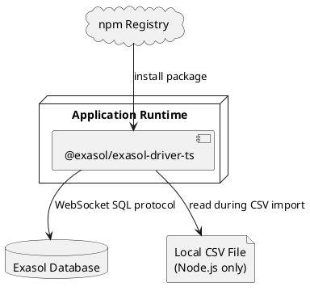

# Deployment View

This chapter describes how the system is packaged and deployed in its execution environment.

## Deployment Environment

The system is installed as the npm package `@exasol/exasol-driver-ts`. Application builds consume CommonJS, ES module, and TypeScript declaration artifacts from `dist/`.

At runtime, the package runs inside the consuming browser or Node.js process and connects to an external Exasol database.

## Runtime Nodes

The relevant deployment nodes are:

* Browser JavaScript runtime.
* Node.js process.
* Exasol database server.
* Local filesystem for Node.js CSV import.
* npm package registry.
* GitHub Actions release workflow.

## Deployment Diagram

## Deployment Strategy

Users install the package from npm. Node.js users install a WebSocket implementation separately when needed. The package is built with Rollup from `src/index.ts` into CommonJS and ES module outputs. Releases are currently performed manually according to the developer guide, with GitHub release automation publishing to npm.

## Open Issues

* None known.
